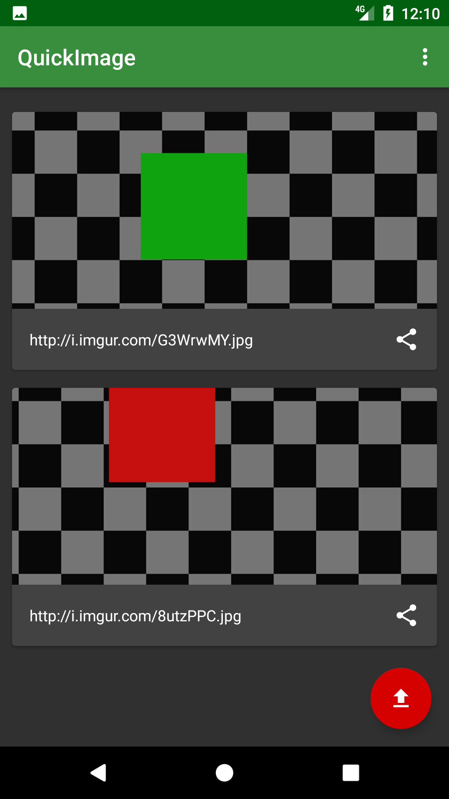
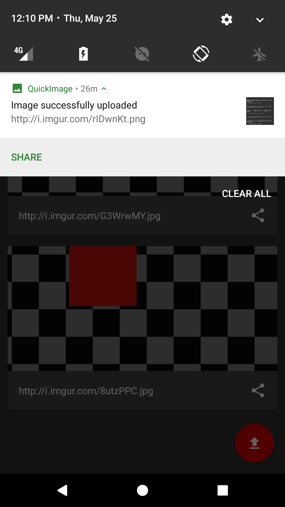

# QuickImage

Simple application for quick creation of image links.

# Features

- Integration with android share menu
- Automatic copy to clipboard
- History of all uploaded images

# Build

- Register an application on Imgur [here](https://api.imgur.com/oauth2/addclient).
    - You can enter into the linked form whatever you want.
- Create a `gradle.properties` file with the following content:

```
IMGUR_API_CLIENT_ID="<Your Client ID goes here>"
```

- Build using Gradle

```
./gradlew assembleDebug
```

# Screenshots




# License

TODO